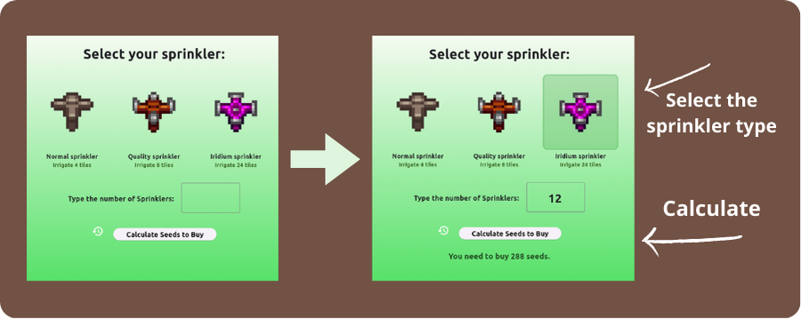

<h1 align="center"> Stardew Seed Counter Assistant </h1>

The app makes it easier to count the seeds to buy in Stardew Valley, based on the number of sprinklers the user has.  

 

  

 

## 🚀 Used tools

- Flutter
- Git e Github
- Figma

